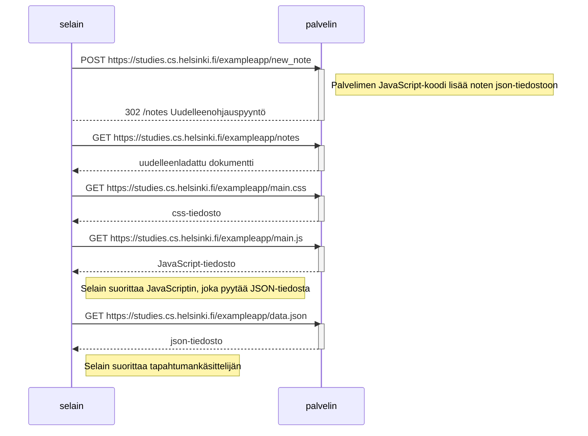

```mermaid
sequenceDiagram
    participant selain
    participant palvelin

    selain->>palvelin: POST https://studies.cs.helsinki.fi/exampleapp/new_note
    activate palvelin
    Note right of palvelin: Palvelimen JavaScript-koodi lisää noten json-tiedostoon
    palvelin-->selain: 302 /notes Uudelleenohjauspyyntö
    deactivate palvelin

    selain->>palvelin: GET https://studies.cs.helsinki.fi/exampleapp/notes
    activate palvelin
    palvelin-->>selain: uudelleenladattu dokumentti
    deactivate palvelin
    
    selain->>palvelin: GET https://studies.cs.helsinki.fi/exampleapp/main.css
    activate palvelin
    palvelin-->>selain: css-tiedosto
    deactivate palvelin
    
    selain->>palvelin: GET https://studies.cs.helsinki.fi/exampleapp/main.js
    activate palvelin
    palvelin-->>selain: JavaScript-tiedosto
    deactivate palvelin
    
    Note right of selain: Selain suorittaa JavaScriptin, joka pyytää JSON-tiedosta
    
    selain->>palvelin: GET https://studies.cs.helsinki.fi/exampleapp/data.json
    activate palvelin
    palvelin-->>selain: json-tiedosto
    deactivate palvelin    
    Note right of selain: Selain suorittaa tapahtumankäsittelijän

```