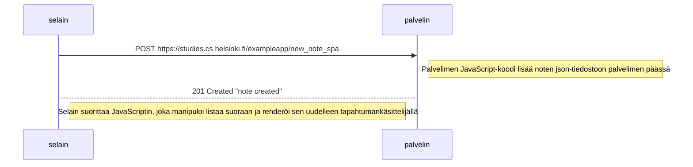

```mermaid
sequenceDiagram
    participant selain
    participant palvelin

    selain->>palvelin: POST https://studies.cs.helsinki.fi/exampleapp/new_note_spa
    activate palvelin
    Note right of palvelin: Palvelimen JavaScript-koodi lisää noten json-tiedostoon palvelimen päässä
    palvelin-->selain: 201 Created "note created"

    
    Note right of selain: Selain suorittaa JavaScriptin, joka manipuloi listaa suoraan ja renderöi sen uudelleen tapahtumankäsittelijällä
    
 

```